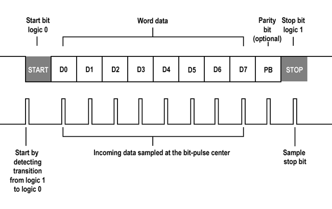

# 🔌 UART Controller — Basys3 FPGA

A UART controller implemented in VHDL and targeting the **Digilent Basys3** board (Xilinx Artix-7). The design allows the board to transmit pre-stored byte sequences from an on-chip ROM over a serial line, and to receive incoming UART frames displayed in real time on the 4-digit 7-segment display.

---

## ✨ Features

- UART TX and RX at **9600 baud** with odd parity bit
- **3 programmable send sequences** triggered by physical buttons
- Received byte shown live on the **7-segment display** alongside switch values
- Generic **N-channel debouncer** for all button inputs
- Project rebuilt from a **TCL script** — no binary Vivado files tracked

---

## 🛠️ Hardware Requirements

| Item | Details |
|---|---|
| Board | Digilent Basys3 (Artix-7 XC7A35T) |
| Clock | 100 MHz onboard oscillator |
| Interface | USB-UART bridge (onboard or external) |
| Baud rate | 9600 |
| Frame format | 1 start bit — 8 data bits — 1 parity bit (odd) — 1 stop bit |



---

## 📁 Repository Structure

```
UART_Controler/
├── UART_Controler.srcs/
│   ├── sources_1/          # VHDL design sources
│   │   ├── top.vhd
│   │   ├── tx_transmitter.vhd
│   │   ├── rx_reciever.vhd
│   │   ├── clock_divider.vhd
│   │   ├── debouncer.vhd
│   │   └── sw_to_7_seg.vhd
│   ├── constrs_1/new/      # XDC pin constraints (Basys3)
│   └── sim_1/new/          # Testbenches (if any)
├── UART_Controler.tcl      # TCL script to recreate the Vivado project
└── .gitignore
```

> The Vivado project file (`.xpr`) and all generated outputs (bitstreams, logs, synthesis runs) are excluded from version control. Use the TCL script below to recreate the project.

---

## 🧩 Module Overview

### ⏱️ `clock_divider.vhd`
Generates a **9600 Hz tick** from the 100 MHz board clock by counting to 10 416. The tick drives both the TX and RX modules to ensure they sample and shift at the correct baud rate.

### 📤 `tx_transmitter.vhd`
Transmits one byte over `tx_line` when `send_byte_signal` pulses high. Builds a full 11-bit frame on the fly: `start(0) | data[7:0] | parity(XOR) | stop(1)`. Bits are shifted out one per tick on a rising-edge of the baud tick.

### 📥 `rx_reciever.vhd`
Detects the falling edge of `rx_line` (start bit) and captures 11 bits at baud rate into a shift register. On completion, `byte[7:0]` is updated and the parity bit is forwarded to the `led` output for quick visual checking.

### 🔘 `debouncer.vhd`
A **generic N-channel debouncer** (parameterised with `N`). Counts 2²¹ cycles (~21 ms at 100 MHz) of input stability before passing a signal as clean. All three buttons (btnC, btnR, btnU) are debounced together as a 3-bit vector.

### 🔢 `sw_to_7_seg.vhd`
Multiplexes a 16-bit value across the 4 seven-segment digits using a 20-bit refresh counter (~2.6 ms per digit). The upper byte shows the last received UART byte; the lower byte mirrors the 8 switches. Supports hexadecimal display (0–F).

### 🔝 `top.vhd`
Top-level entity wiring all modules together. Contains a **4-state FSM** (`IDLE → SEND_BYTE → DELAY → back`) that walks through a ROM address range and fires one byte per iteration:

| Button | ROM range | Content |
|---|---|---|
| `btnR` | 0 – 15 | Sequence A (16 bytes) |
| `btnC` | 16 – 34 | Sequence B (19 bytes) |
| `btnU` | 35 – 89 | Sequence C (55 bytes) |

The ROM is a Xilinx Block Memory IP (`blk_mem_gen_0`, 4 KB, 12-bit address, 8-bit data).

---

## 🚀 Getting Started

### 1️⃣ — Recreate the Vivado project

Open Vivado's Tcl console and run:

```tcl
source UART_Controler.tcl
```

This will recreate the project with all sources and constraints.

### 2️⃣ — Add ROM content

The design instantiates a Xilinx Block Memory Generator IP (`blk_mem_gen_0`). After recreating the project, re-generate the IP or provide your own `.coe` initialisation file with the byte sequences you want to send.

### 3️⃣ — Synthesise, implement, and program

Run synthesis and implementation from Vivado, then program the Basys3 via USB. No external wiring is required if using the onboard USB-UART bridge.

---

## 📌 I/O Mapping

| Signal | Direction | Description |
|---|---|---|
| `clk` | in | 100 MHz master clock |
| `sw[7:0]` | in | 8 slide switches |
| `btnC` | in | Center button — triggers sequence B / 7-seg reset |
| `btnR` | in | Right button — triggers sequence A |
| `btnU` | in | Up button — triggers sequence C |
| `rx_line` | in | UART receive line |
| `tx_line` | out | UART transmit line |
| `seg[6:0]` | out | 7-segment cathodes |
| `an[3:0]` | out | 7-segment common anodes |
| `led` | out | Parity bit of last received frame |

---

## ⚠️ Known Limitations

- The parity bit is transmitted (odd XOR) but **not verified** on reception — the `parity` output is exposed raw, with no error flag.
- The `MEMORY_INCREMENT` FSM state is declared but currently unused; the address increment logic lives inside `DELAY`.
- The `tx_done` signal on `tx_transmitter` is declared but not connected in the top level.
- ROM content depends on the Xilinx IP, which must be regenerated after cloning.
